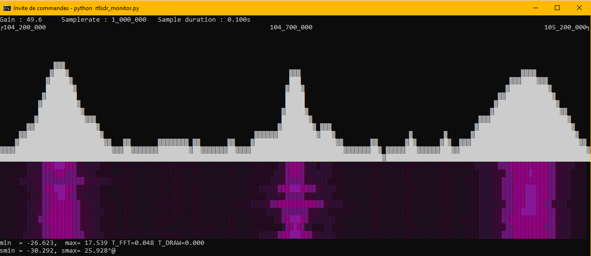

# rtlsdr-monitor

An attemp to create a cool SDR vizualizer in a console window.

You have to install some external Python libraries : `pip install pyrtlsdr pyrtlsdrlib windows-curses`.

## Features (not a lot) :

- Simple power spectrum but beautifull purple waterfall
- Change frequency with UP / DOWN or PGUP / PGDOWN key
- Enter frequency with ENTER (you can use "446.5M" to tune to 446 000 000 Hz)
- Change gain with g or G
- Change sample rate with s or S (from 250kHz to 3MHz)
- Change sample duration with d or D (from 1ms to 1s)
- Quit with Escape

